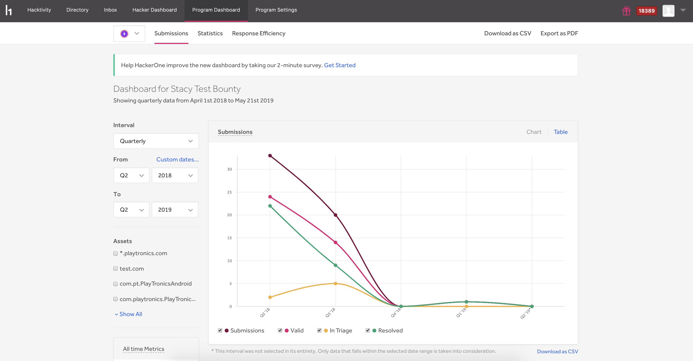
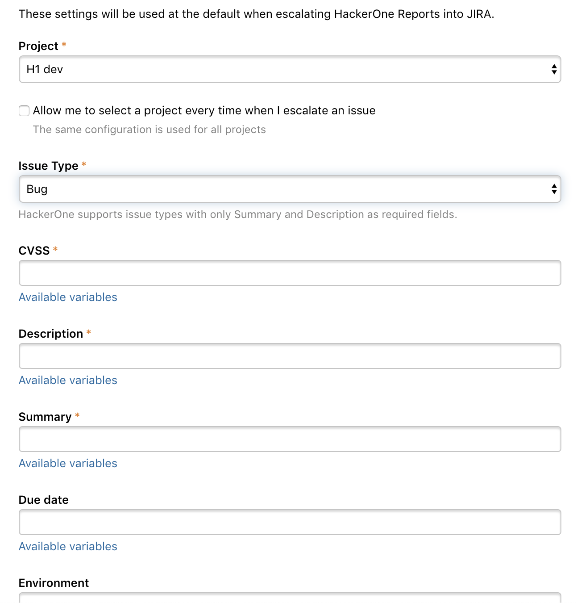
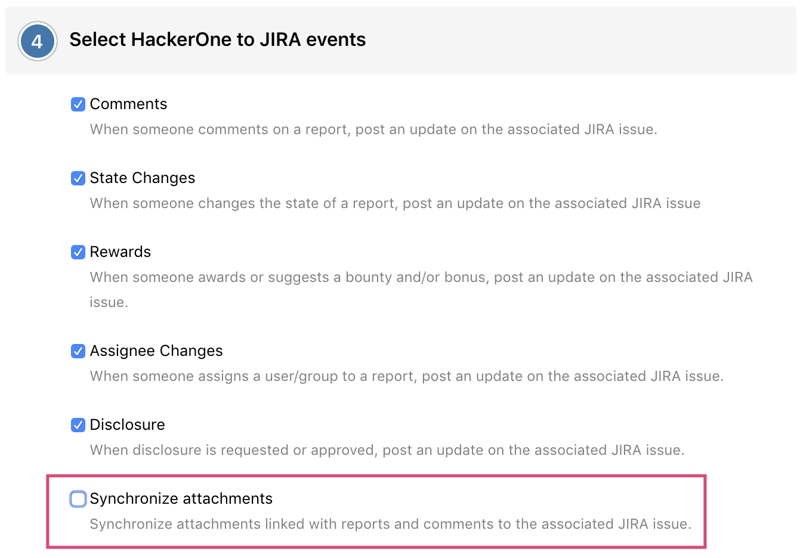
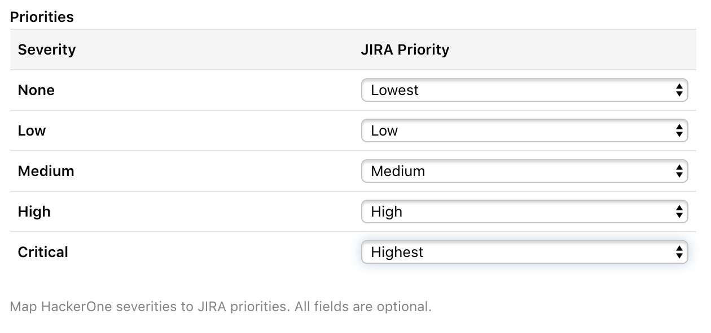

### Program Dashboard
We’ve revamped the Program Dashboard with new metric tables and charts that give better insight into reporting and analytics for programs.

### Enhancements to the Jira Integration
We've added these improvements to the bi-directional Jira integration:

#### Additional Fields
The HackerOne to Jira escalation template now includes all additional fields that are either a type of `string`, `number`, or `date`. This enables Jira users to have all fields in Jira be mapped to a value from the HackerOne report. All available Jira fields will automatically be pulled from the selected issue type.

#### Sync Attachments
Jira users can now sync attachments from their HackerOne report to Jira by selecting **Synchronize attachments** in the **Select HackerOne to JIRA events** section when configuring their Jira integration.

#### Automated Report Closure
Jira users can now select which Jira closed issue status should result in the closure of the HackerOne report.

#### Severity to Priority Mapping
With severity to priority mapping, Jira users can map HackerOne severity ratings to the priority fields they have in Jira. This enables the right priority to be set when escalating a report to Jira.

