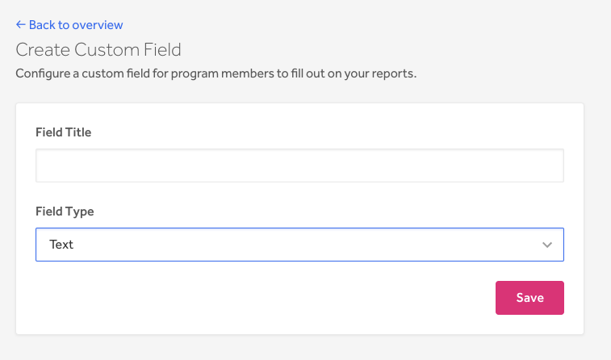
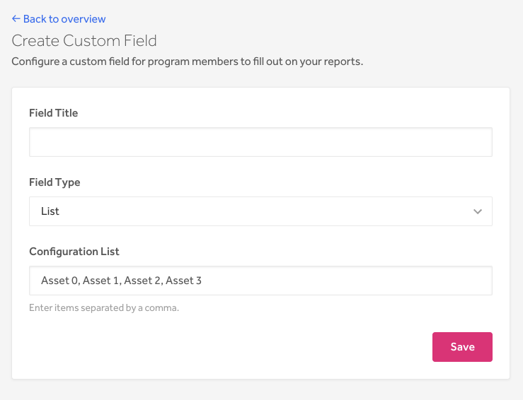
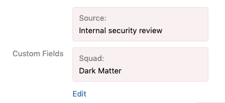
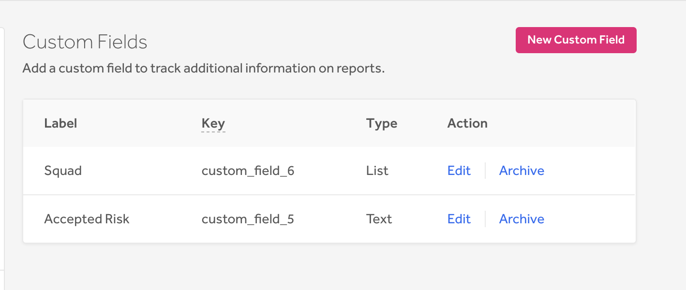

Program administrators can configure custom fields to add data to their reports. This enables your program members to add additional information to your reports to help you better manage and analyze your internal data by the categories that you define to be important, such as by business unit or by root cause analysis.

<b>Note:</b> This feature is currently in beta and is only available for select programs. You must be an enterprise program to opt-in to the feature. If you’re an enterprise program and would like to opt-in to the feature, please contact your program manager.

In this article, you can learn to:|
--------------------------------- |
[Create a Custom Field](#create)|
[Fill in a Value for a Custom Field](#fill)|
[Edit a Custom Field](#edit) |
[Archive a Custom Field](#archive) |

<h3 id="create">Create a Custom Field</h3>

> **Note:** You must be an administrator of the program in order to add a custom field.

To create a custom field:
1. Go to **Program > Customization > Custom Fields**.
2. Click **New Custom Field**.
3. Enter the **Field Title** on the **Create Custom Field** page.
4. Select the **Field Type**. You can choose from:

Option | Details
------ | --------
Text | This option enables you to create an editable text field.  
List | This option enables you to create a drop-down list that you can select from when editing your custom field.  Enter your option items in the **Configuration List** field separated by a comma.  

5. Click **Save**.

All of your reports will now have a Custom Fields section. You can edit the section to add the Custom Field label you created.

The custom field will also be added into your inbox filter so that you can filter your reports by the custom field you created. (The image below shows the filter 2 custom fields that were created: Squad and Root Cause Analysis)

<h3 id="fill">Fill in a Value for a Custom Field</h3>
To fill in a value for a Custom Field to your report:
1. Go the report you want to add a custom field to.
2. Click **Edit** in the Custom Fields section.

3. Enter the information you want to add to the field for each field label.
4. Click **Save and add fields**.

The information you input will now be tied to your field labels. To edit the information, click **Edit**.

When you export your reports as a CSV file, the custom field and the information associated will also be included in the export.

<h3 id="edit">Edit a Custom Field</h3>
You can edit your custom fields to change the name of the field title.

To edit the title of a custom field:
1. Go to **Program > Customization > Custom Fields**.
2. Click **Edit** for the custom field label you want to edit.
3. Enter the new title.
4. (*Optional*) Change the **Field Type** from *Text* to *List*. You can only change the field type from *Text* to *List*. You can’t change a *List type* to a *Text type*.
5. Click **Save**.

<h3 id="archive">Archive Custom Fields</h3>
You can archive custom fields that you no longer want to use. We don’t enable you to permanently delete custom fields to prevent data loss.

To archive a custom field:
1. Go to **Program > Customization > Custom Fields**.
2. Click **Archive**.

The archived field can no longer be added to new reports. Current and past reports with the archived field will remain on the report and won’t disappear. You can, however, edit the field within the report.  

You can unarchive an archived custom field by clicking **Unarchive**.
