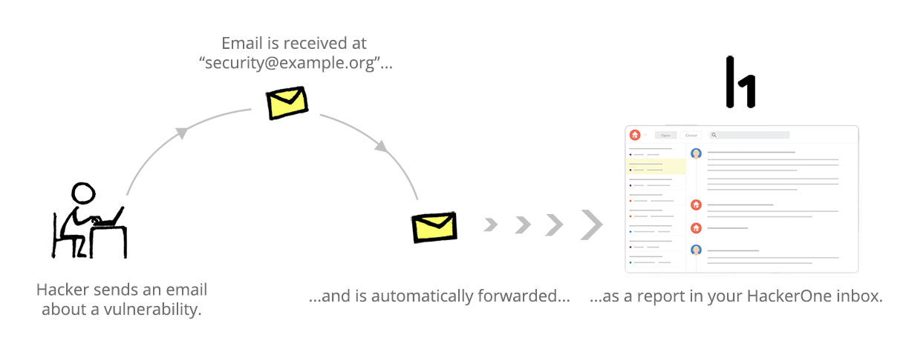
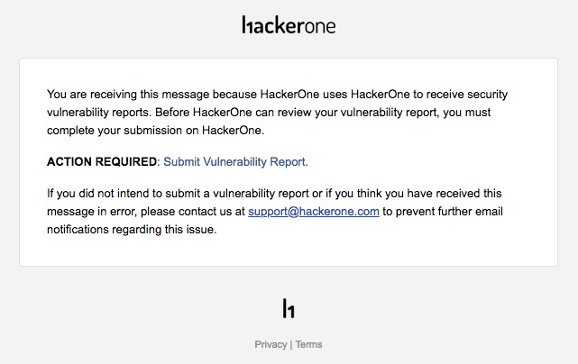
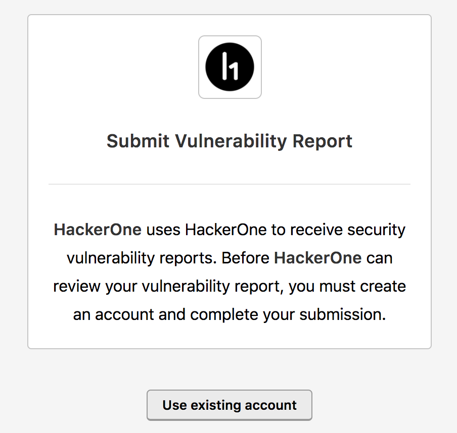
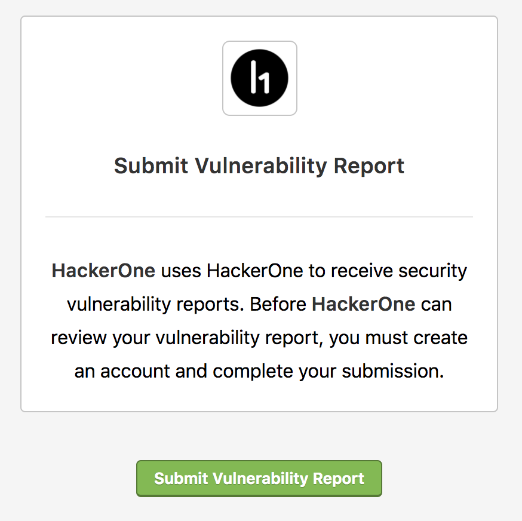
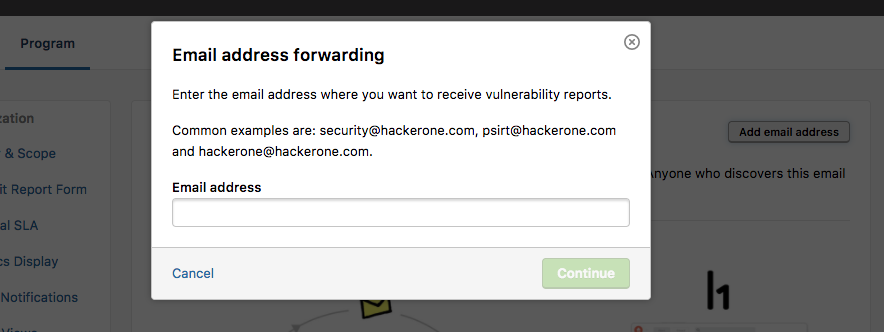
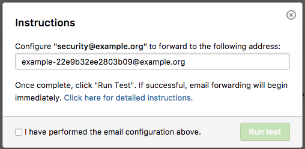
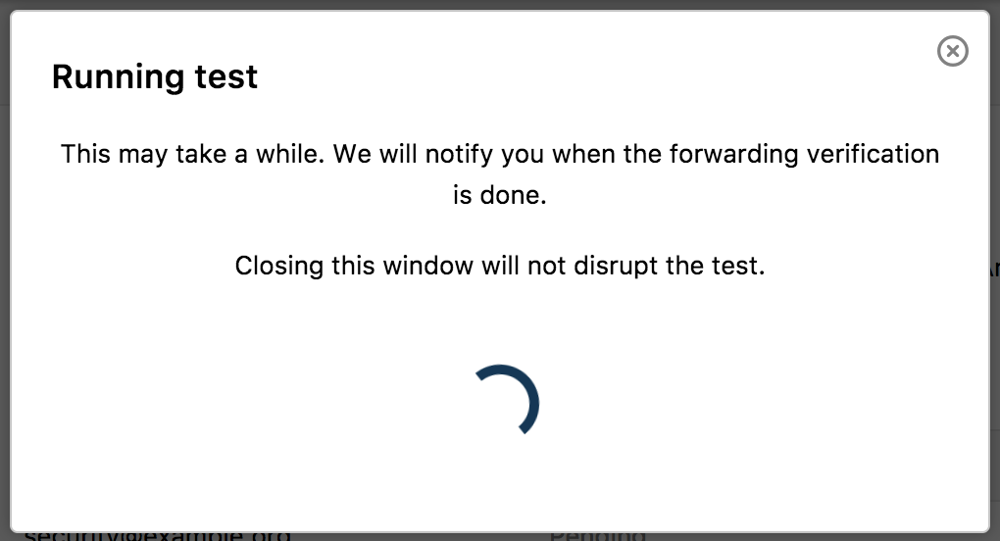
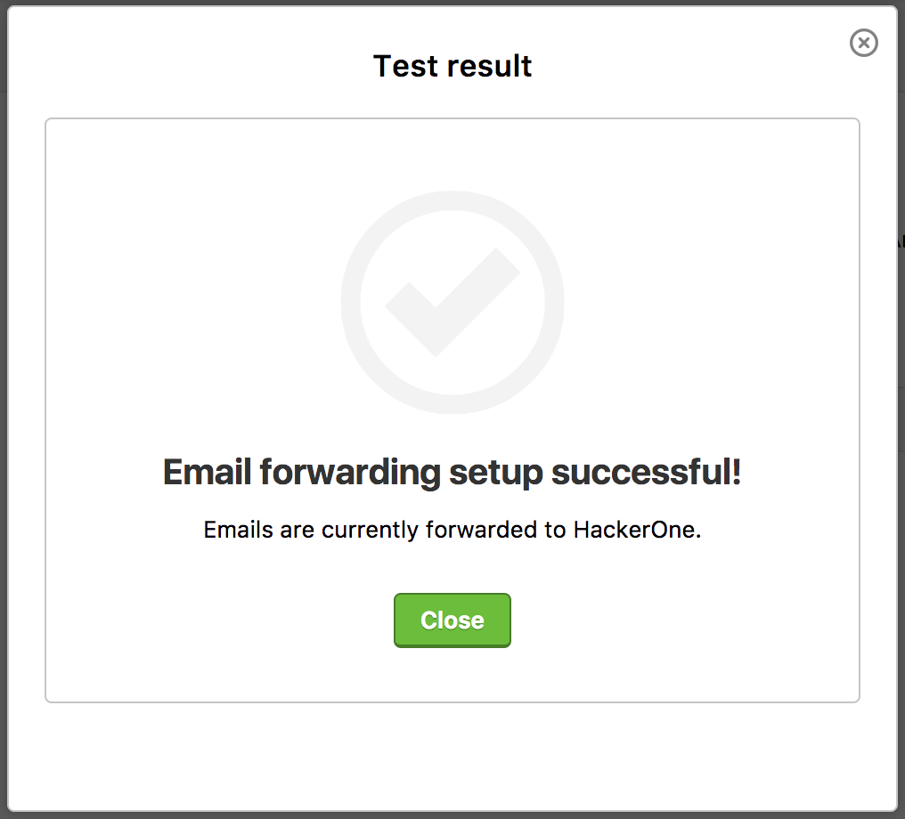
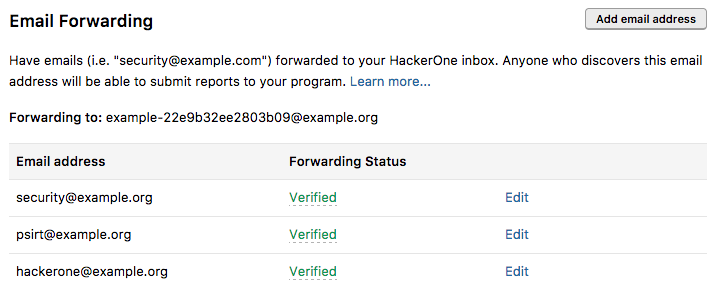

You can set up emails to be forwarded to your HackerOne inbox to enable report management directly through HackerOne. Hackers that discover these specific email addresses will be able to submit reports directly to your program. Upon sending reports through the email, they'll also automatically get invited to your program.

><i>Note: This feature isn't available until your program is launched and not in sandbox mode.</i>

### How Does it Work?
When a hacker discovers a vulnerability and sends their finding in an email to security@example.org:
1. Their emails are forwarded to HackerOne's inbox and saved as report drafts.
2. The hacker will receive an auto-response email notifying them that your program uses the HackerOne platform to coordinate vulnerabilities. They can click the **Submit Vulnerability Report** link.

3. The link will prompt the hacker to create a HackerOne account if they don't already have one, or to log in to their existing account.

4. After the hacker signs in to the account, the **Submit Vulnerability Report** button will be available for them to click. Upon clicking this button, the hacker is automatically invited into your program. The button will take them to the report submissions page, where they can claim the report draft and submit a valid HackerOne report to your program.

5. You will then be notified of a new vulnerability submitted by the hacker in your inbox where you can use the platform tools to comment, triage, and pay bounties.

### Set Up
1. Go to **Settings > Program > Hacker Management > Email Forwarding**.
2. Click on **Add email address**.
3. Enter the email address the vulnerability reports should be sent to. A common example is: security@example.org.

4. The inbox address that your email will be configured to will automatically generate. Upon configuration, emails sent to security@example.org will be forwarded to the inbox address given.

5. Click **Run test** to ensure that forwarding is set up correctly.

><i>Note: You can add multiple email addresses to forward to the same inbox.</i>

Don't know how to set up email forwarding for your email provider? Check out these resources for:
- [Microsoft Outlook 365](https://support.office.com/en-US/article/Forward-email-to-another-email-account-1ED4EE1E-74F8-4F53-A174-86B748FF6A0E)
- [Microsoft Exchange Server](https://technet.microsoft.com/en-us/library/dd351134(v=exchg.141).aspx)
- [G Suite (formerly Google Apps)](https://support.google.com/a/answer/175745?hl=en)
