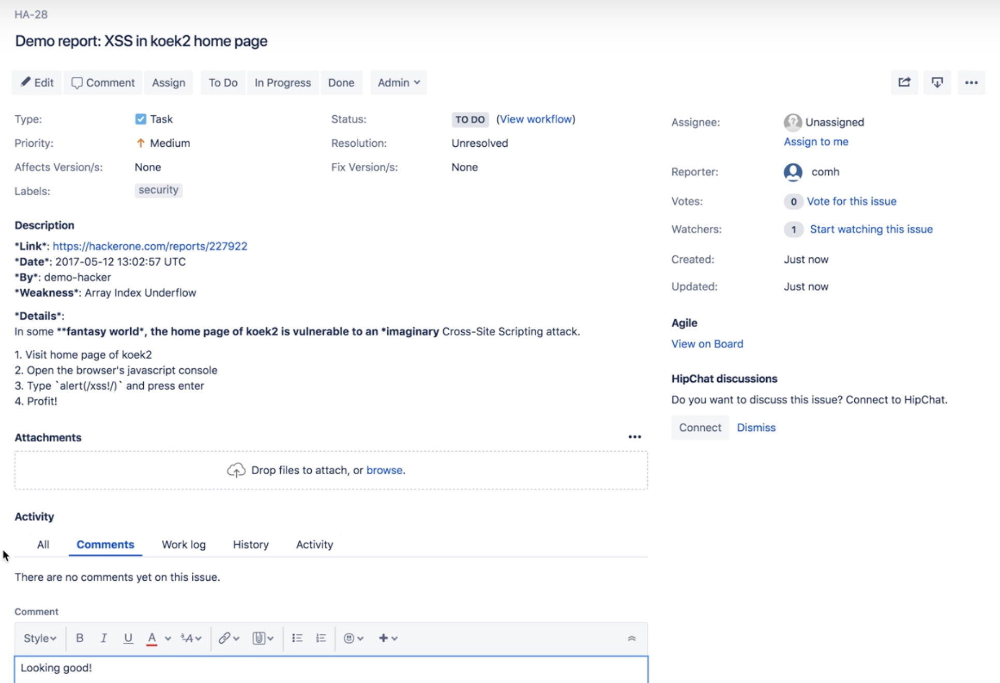
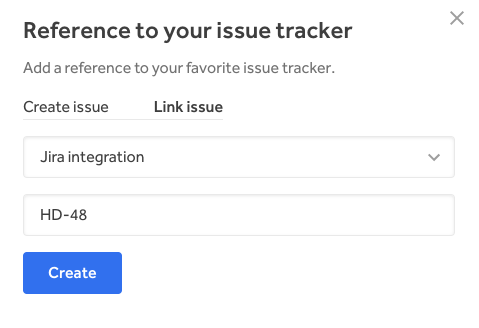

HackerOne offers a bi-directional Jira integration that syncs information between your HackerOne report and the Jira issue. You can choose to integrate with Jira Cloud or Jira Server. This means that Jira users can sync specific workflows from Jira to HackerOne and vice versa, from HackerOne to Jira. This integration helps your development and security teams stay aligned, and contributes to a better workflow to process security vulnerabilities as it minimizes the back and forth between Jira and HackerOne.

Jump to: |
-------- |
[Creating a Jira issue](#creating) |
[Linking HackerOne Reports to Existing Jira Tasks](#linking) |
[Syncing updates from HackerOne to Jira](#hackerone-to-jira) |
[Syncing updates from Jira to HackerOne](#jira-to-hackerone) |
[Automatically resolving a HackerOne report](#auto-close) |
[HackerOne Severity to Jira Priority Mapping](#mapping) |
[Installing the Jira integration](#installing) |

<h3 id="creating">Creating a Jira issue</h3>
You can create new Jira issues for reports you receive on HackerOne.

To create a new Jira issue from your HackerOne report:
1. Go to the HackerOne report in your inbox that you want to create a new Jira issue for.
2. Click **Edit** next to <i>References</i>.
3. Click **Create Jira issue**. 

4. Select the project that you want the issue to link to in the dropdown. *Note: This option occurs only if you have multiple projects to select from. If you only have 1 project, the issue will automatically escalate to that project.*

5. Click on the Jira ID to access the report in Jira.

  

6. Add comments or change the state of the report in Jira.

  

When you perform an action on the Jira report such as adding a comment or changing the status of the report, Hackbot will generate an internal comment on the HackerOne report to reflect the changes.

  

<h3 id="linking">Linking HackerOne Reports to Existing Jira Tasks</h3>
You can link your HackerOne reports to existing Jira tasks.

To link your reports:
1. Go to the HackerOne report in your inbox that you want to link to Jira.
2. Click **Edit** next to <i>References</i>.

3. Enter the Jira ticket reference ID in the **Link Jira ticket** field.
4. Click **Link Jira issue**.

The HackerOne report will now be linked to the Jira task, and all activities that are performed on the report will be synced to the corresponding task.

There's also another way you can link your HackerOne reports to Jira. You can:
1. Go to the bottom of your HackerOne report.
2. Select **Change state > Triaged** in the action picker.

3. Enter the Jira ticket number in the **Enter Jira ticket #** field.
4. Click **Link Jira issue**.

<h3 id="hackerone-to-jira">Syncing updates from HackerOne to Jira</h3>

With the Jira integration you can sync these report updates to Jira: 
- Report Comments
- State changes
- Rewards
- Assignee changes
- Public disclosure

All updates on a report are synced as a comment to Jira. Additionally, all actions are configureable and can be toggled from the Jira integration settings page. 

If you've configured your own [custom fields](/programs/custom-fields.html), you can use them in the Jira integration. All custom fields automatically appear as available variables that you can use to set up the field mapping between HackerOne and Jira.

<h3 id="jira-to-hackerone">Syncing updates from Jira to HackerOne</h3>

To make sure your security team stays up to date with the changes that happen in Jira, you can sync back activities from Jira to the HackerOne report. All updates from Jira will be reflected in HackerOne as an internal comment on the associated report. 

We currently support these activities from Jira to HackerOne:
- Comments
- State changes
- Resolution changes
- Assignee changes
- Priority changes

You can choose which events you want to synchronize from Jira as each of the activities can be toggled individually.

<h3 id="auto-close">Automatically resolving a HackerOne report</h3>

You can set your integration to automatically close a HackerOne report as <i>Resolved</i> when a Jira issue closes. This enables the hacker to be notified right away when the Jira issue that's linked to the report is closed. In the **Select Jira to HackerOne events** section of the integration setup, select the Jira issue status that will trigger the closure of the HackerOne report. 

<h3 id="mapping">HackerOne Severity to Jira Priority Mapping</h3>

You can map HackerOne severity ratings to the Jira priority fields when configuring your integration. This enables the right priority to be set when escalating a report to Jira. 

<h3 id="installing">Installing the Jira integration</h3>

You can choose to integrate from 2 different types of Jira integrations:

Option | Details
------ | -------
[Jira Cloud](jira-cloud-integration.html) | You can access Jira from anywhere in the world.
[Jira Server](jira-server-integration.html)| Jira is self-hosted and can be behind a firewall or VPN.
