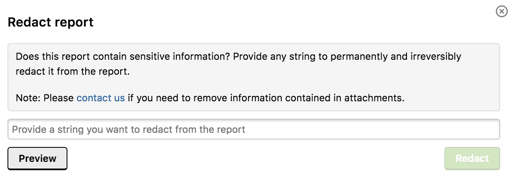

When disclosing reports, you can choose to limit the information that’s shared instead of disclosing the report in full detail. You can choose to limit information published in a report at the time you disclose the report and after the report has been made public. 

There are 2 ways you can limit information: |
------------------------------------------- |
[Redacting Reports](#redacting) |
[Limited Disclosure](#limited) |

<h3 id="redacting">Redacting Reports</h3>

Some reports may contain sensitive information or information that’s not meant to be for the general public. Redacting reports enables you to censor specific words or characters from being visible to readers. Once you redact any string, the specified string will be blacked out throughout the report as seen in the image below. Keep in mind that once you redact something from a report, it’ll permanently and irreversibly be redacted.

To redact information from a report:
1. Go to the report you want to redact.
2. Find the **Visibility** field in the report metadata.
3. Click **Redact**.

4. Enter the string that you want to redact from the report.

5. <i>(Optional)</i> Click **Preview** to see how the redactions will look in the report.
6. Click **Redact**.

If you have multiple strings that you want to redact, repeat steps 2-6.

<h3 id="limited">Limited Disclosure</h3>

In addition to redacting reports, you can limit the visibility of reports by selecting Limited disclosure. When you select to have limited instead of full disclosure, only the summary and timeline of the report are visible and all comments and attachments are hidden.

If your report is already fully disclosed, click **Disclosed (Full)** in the report metadata to toggle the report to have limited disclosure. Your report must have a summary in order to toggle between Full and Limited disclosure. To add a summary, click **ADD SUMMARY** in your report.

You can toggle between Full and Limited disclosure at anytime. Just click **Disclosed (Limited)** to toggle back to full disclosure.

To disclose your report, follow the steps to [request disclosure](disclosure.html).

Here's a good example of a limited disclosure report from the Shopify security team: https://hackerone.com/reports/64164.
