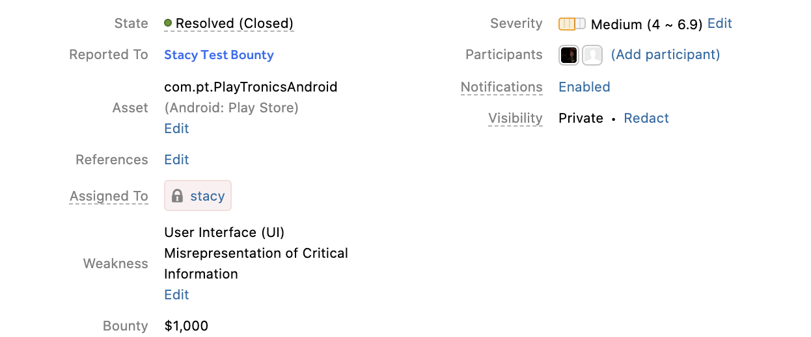

Reports in your inbox consist of different components to give you a holistic view of the vulnerability.

### Hacker Info
The top of the report shows the hacker that submitted the report as well as their hacking statistics by reputation, signal, and impact.

### Report ID and Title
Below the hacker information is the report ID number and title. You can change the report title to your internal naming conventions. The color behind the report number represents the state the report is in. These are the different colors and the [report states](report-states.html) they represent:

Color | Report State
----- | ---------
Purple | New
Light Blue | Needs more info
Yellow | [Retesting](retesting.html)
Green | Resolved
Orange | Triaged
Brown | Duplicate
Grey | Informative
Red | Not Applicable

### Report Metadata
You’ll be able to view these metadata fields underneath the title of your report:

Metadata Field | Details
-------------- | --------
State | The state the report is in.
Disclosed | The date the report was disclosed. Only shows for reports that were disclosed.
Reported To | The name of the program the report was submitted to.
Asset | The specific asset the vulnerability was found on.
Reference | Add a reference to the CVE ID and to the ticket associated with the report in your issue tracking tool.
Assigned to | *(An internal field that is only seen by the program’s security team)* The person on your security team that's assigned to triage or manage the report.
Weakness | The type of weakness of the vulnerability.
Bounty | (*Only shows for resolved reports that were given a bounty*) How much bounty the report was awarded.   
Severity | The severity level of the vulnerability.
Participants | All of the hackers involved in finding the vulnerability.
Notifications | Indicates whether you have notifications enabled or disabled for actions on your program.
Visibility | Indicates the status of disclosure of the vulnerability. You can also choose to redact private information from the report.

### Summary
Either your security team or the hacker(s) involved with the report can choose to provide an optional summary of the report. Including a summary helps future viewers of the report to understand the context without having to scroll through the entire report. Click **ADD SUMMARY** to add a summary to the report.

### Timeline
The report timeline shows all of the activity that occurs in the report between you and the hackers involved. It will show when:
* You or the hacker adds a comment
* The state of the report changes
* The report has been assigned or unassigned
* A bounty is set
* A bounty has been given
* A hacker requests mediation
* You or the hacker requests public disclosure  

Internal comments and actions made within your program security team will be surrounded with a red box and a lock icon to denote that the comment will only be seen by internal members and not by hackers.

If you have [hackbot](hackbot.html) enabled, you’ll also be able to view your suggestions from hackbot, which will also be internal.

